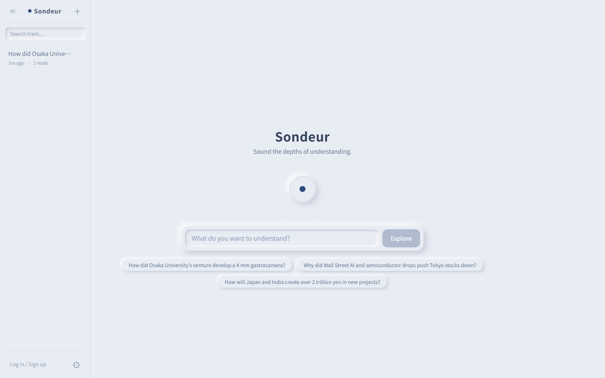
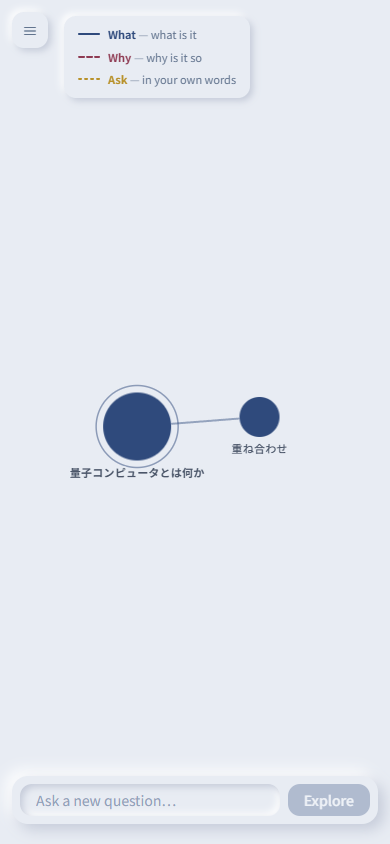

# Sondeur

**わからないことを、わかるまで測深する。**

AIの説明の「わからない箇所」をスパン選択し、**What is it**（それは何か）/ **Why is it**（なぜそうなのか）の二択で掘り下げる学習サービス。掘った履歴は木構造として蓄積され、理解の航跡＝資産になる。

🌐 **Live: https://sondeur.vercel.app**

| ホーム | 探索ツリー (モバイル) |
|---|---|
|  |  |

## コアループ

1. 質問を入力 → AIの説明がルートノードにストリーミングされる
2. 本文の語句をドラッグ（スマホは長押し）で選択 → **What / Why / Ask** のピルで掘り下げ
3. グラフに新ノードが生え、探索の航跡が木構造として残る
4. 掘り済みスパンは本文中にハイライトされ、クリックで既存ノードへジャンプ
5. ツリーは公開リンクで共有できる（いつでも取り消し可能）

## 機能

- **探索ツリー**: D3 force simulation のグラフ + スパン選択駆動の展開
- **LLM**: OpenAI Responses API + web_search（モデル判断で検索）、事実性規律プロンプト、ストリーミング
- **認証・同期**: Supabase マジックリンク認証。ゲスト（localStorage）→ ログインでツリー自動移行
- **課金**: Stripe サブスクリプション（Free 20 / Standard 250 / Pro 600 ノード/月、USD建て）
- **共有**: ツリー単位の公開リンク + RLS による読み取り制御
- **i18n**: 日本語 / English（プロンプトの出力言語も切替）
- **モバイル対応**: サイドバー=ドロワー、読みパネル=ボトムシート、タッチ選択対応

## 設計のポイント

- **quota はサーバー側でアトミックに enforcement** — `SECURITY DEFINER` の RPC が月次カウンタを条件付き UPDATE で消費。クライアント改ざん不可、profiles テーブルは読み取り専用化
- **ゲストのレート制限も永続化** — IP の SHA-256 ハッシュ（生 IP は保存しない、3日で自動削除）を Supabase でカウント。サーバーレスのインスタンス揮発に依存しない
- **RLS 全面適用** — 全テーブル行レベルセキュリティ + 親ノード整合性トリガー + `search_path` 固定の DEFINER 関数
- **エラー監視は DSN 未設定で完全 no-op** — Sentry を fail-open 箇所（quota / rate limit / webhook）に仕込みつつ、env なしでもビルド・動作する
- **ノード追記のみの設計** — 同期は「作成時 insert + 生成完了時の content 確定」だけで成立する

## 技術スタック

Next.js 16 (App Router / Turbopack) · React 19 · Tailwind CSS 4 · D3 · Supabase (Auth / Postgres / RLS) · Stripe · OpenAI Responses API · Sentry · Vercel

## 開発

```bash
npm install
npm run dev        # 開発サーバー
npm test           # vitest (スパン分割 / quota / レート制限 / i18n キー網羅性)
npm run typecheck  # tsc --noEmit
```

LLM応答を有効にするには `.env.local` に以下を設定（未設定時はモックストリーミングで動作）:

```
OPENAI_API_KEY=sk-...
SONDEUR_MODEL=gpt-5.4-mini   # 省略可
```

### クラウド同期 (Supabase)

未設定の間はゲストモード（localStorage のみ）で動く。有効化する手順:

1. [supabase.com](https://supabase.com) でプロジェクト作成 → SQL Editor で `supabase/migrations/` を番号順に実行
2. Settings → API の URL と publishable key を `.env.local` へ:
   ```
   NEXT_PUBLIC_SUPABASE_URL=https://xxxx.supabase.co
   NEXT_PUBLIC_SUPABASE_PUBLISHABLE_KEY=...
   SUPABASE_SECRET_KEY=...   # ゲストレート制限用 (service role)
   ```
3. Authentication → URL Configuration の Site URL を設定 → devサーバー再起動

### 課金 (Stripe)

`STRIPE_SECRET_KEY` / `NEXT_PUBLIC_STRIPE_PUBLISHABLE_KEY` / `STRIPE_PRICE_STANDARD` / `STRIPE_PRICE_PRO` / `STRIPE_WEBHOOK_SECRET` を設定。`scripts/setup_stripe.mjs` は USD 月額価格（Standard $12 / Pro $24）を作成する。webhook は `/api/billing/webhook`。

## 構成

```
src/
  app/
    api/expand/        # ストリーミング Route Handler (quota / rate limit ゲート)
    api/billing/       # Stripe checkout / portal / webhook
    api/share/         # 共有のオン/オフ
    s/[id]/            # 共有ツリーの公開ページ (SSR + OGP)
    legal/             # 特商法 / 利用規約 / プライバシーポリシー
  components/          # GraphView (D3) / ReadingPanel / Sidebar
  lib/
    store.ts           # localStorage ストア (useSyncExternalStore)
    segments.ts        # スパン分割ロジック (テスト対象)
    planLimits.ts      # プラン別 quota
    guestRateLimit.ts  # ゲストレート制限
supabase/migrations/   # スキーマ + RLS + RPC
prompts/               # LLM プロンプト
```

## License

All rights reserved. ソースコードは学習・参照目的で公開しています。
